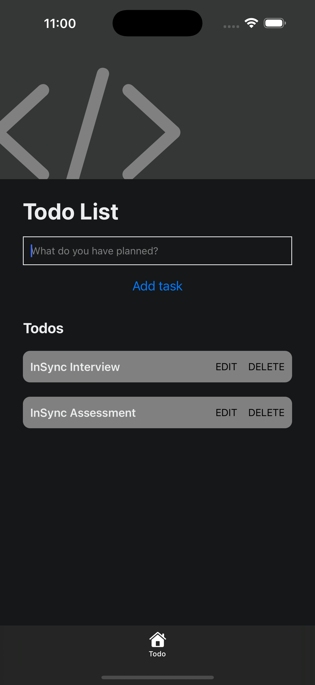

# Todo List App

This is a basic todo list mobile app demonstrating CRUD functionality



## Features
- Add, view, edit, and delete todo items
- Items remain stored on user's device even when the app is closed

## Tech Stack
- [Expo](https://expo.dev) - Development framework for mobile apps
- [React Native](https://reactnative.dev/) - Build mobile apps with react
- [TypeScript](https://www.typescriptlang.org/) - Static type checking for enhanced type safety
- [React Native Async Storage](https://www.npmjs.com/package/@react-native-async-storage/async-storage) - Asynchronous, persistent storage system for data persistence
- [React Native Testing Library](https://callstack.github.io/react-native-testing-library/) - Testing library for basic tests

## Get started

1. Install dependencies

   ```bash
   npm install
   ```

2. Start the app

   ```bash
    npx expo start
   ```

In the output, you'll find options to open the app in a

- [development build](https://docs.expo.dev/develop/development-builds/introduction/)
- [Android emulator](https://docs.expo.dev/workflow/android-studio-emulator/)
- [iOS simulator](https://docs.expo.dev/workflow/ios-simulator/)
- [Expo Go](https://expo.dev/go), a limited sandbox for trying out app development with Expo
